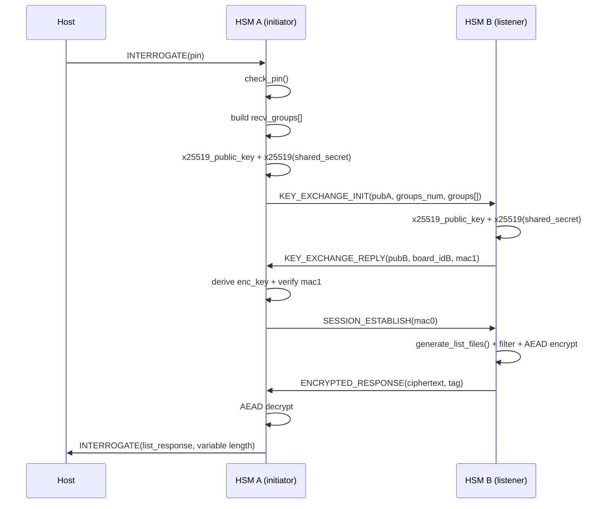

# Rapporto tecnico analitico sul fallimento del test e sul redesign dell’operazione interrogate

## Executive summary

L’analisi congiunta di documento di design, log del test e repository (ZIP) evidenzia due cause principali del fallimento: **(a) errore funzionale** nell’output di *interrogate* (la lista restituita non include i file attesi) e **(b) superamento del budget temporale imposto dagli host tools** (limite 1000 ms), con tempi osservati ~**3.07–3.17 s**. fileciteturn0file0 fileciteturn0file1 fileciteturn0file2

Sul piano funzionale, il test fallisce perché **l’“Actual HSM” restituisce una lista vuota** mentre l’HSM di riferimento contiene almeno un file (es. `slot: 0, gid: 31208, name: test.txt`). Questo mismatch è coerente con un bug nel filtraggio lato “listener” (*listen* → ramo `INTERROGATE_MSG`): il codice confronta il `group_id` di ciascun file remoto con **un solo elemento** dell’array dei gruppi richiesti (indicizzato con `file_list.n_files`), facendo sì che, se il primo gruppo non coincide, **nessun file venga mai incluso**. fileciteturn0file1 fileciteturn0file2

Sul piano prestazionale, la latenza end-to-end di *interrogate* è dominata dal costo della **scalar multiplication Curve25519/X25519** (ECDH): nell’implementazione attuale, una singola interrogazione implica, complessivamente tra i due dispositivi, **due generazioni di chiave pubblica** (`crypto_x25519_public_key`) e **due key exchange** (`crypto_x25519`), cioè **quattro scalar multiplications** (operazioni note per essere costose su MCU a bassa potenza). L’ordine di grandezza è compatibile con risultati pubblicati su implementazioni embedded (decine di milioni di cicli per scalar multiplication) e con la semantica di X25519 definita negli RFC IETF. fileciteturn0file2 citeturn0search2turn0search13

Raccomandazioni prioritarie:
- **Correzione del filtraggio** nel ramo *listen/interrogate* (membership set sui gruppi richiesti) per ripristinare la correttezza funzionale. fileciteturn0file2  
- **Riduzione drastica del carico crittografico sul percorso interrogate**, idealmente eliminando l’ECDH “per richiesta” a favore di una derivazione simmetrica con nonces e chiavi pre-provisionate (pairwise o per-neighbor), oppure almeno eliminando la generazione runtime della public key tramite precomputazione/caching. citeturn2search1turn0search2turn0search13  
- **Allineamento documento↔implementazione**: oggi doc e codice divergono su punti chiave (autorizzazione per gruppo via firma, verifica del *key_established_mac*, semantica di *listen* non bloccante). Questo impatta sia sicurezza sia performance e rende più difficile il tuning rispetto ai vincoli degli host tools, che sono fissi e read-only. fileciteturn0file0 citeturn0search4

## Risorse analizzate e differenze tra documento e implementazione

Le risorse esaminate sono:
- Documento di design “OrsoBruno Design v1.0” (PDF), con descrizione di simboli, deployment, protocollo host (header/ACK/chunking) e pseudocodice delle funzioni, inclusa *Interrogate Files* (sezione 5.1.5). fileciteturn0file0  
- Log del test fallito in formato HTML, contenente tracce e stack trace del framework di test (inclusi errori di correttezza e di timing). fileciteturn0file1  
- Repository ZIP (`2026-ectf-unitn-dev_stable.zip`), che include firmware C (MSPM0, Monocypher), design package Python (`ectf26_design`) e definizioni dei messaggi/protocolli. fileciteturn0file2  

### Differenze rilevate tra documento e codice

Nel seguito, “Documento” si riferisce al PDF, “Implementazione” al codice nel repository.

**Autorizzazione della richiesta interrogate per gruppo (firma)**
- Documento: dopo la fase MAC, prevede che per **ogni Group ID** per cui il richiedente ha permesso di receive, si generi un **signed request** con la private receive key (EdDSA), e che il listener riceva/validi tali richieste prima di inviare la lista. fileciteturn0file0  
- Implementazione: nel ramo `listen()` → `INTERROGATE_MSG` **non firma** richieste per gruppo e **non verifica** alcuna firma prima di inviare la lista; inoltre riceve `key_established_mac` ma non risulta una verifica esplicita prima di procedere alla generazione/trasmissione della lista. fileciteturn0file2  

**Derivazione della chiave di sessione (uso dei gruppi)**
- Documento: la PRF su `K_session` incorpora concatenazioni che includono l’insieme dei gruppi richiesti (`Group ID1 || ... || Group IDn`) oltre a board ID e chiavi. fileciteturn0file0  
- Implementazione: la derivazione della `enc_key` usa Blake2b keyed (`K_SESSION`) ma aggiorna il digest con **`recv_groups[0]`** (solo il primo group id), non con l’intera lista; questo riduce l’entropia/legame della chiave al set richiesto e può creare comportamenti non desiderati quando la lista cambia. fileciteturn0file2 citeturn2search1  

**Semantica e comportamento di listen**
- Documento: *listen* è non-PIN-protected e descritta come transizione in stato di ascolto su UART1, con risposta `Listen` a body vuoto; la descrizione è coerente con un comando che “abilita” la ricezione. fileciteturn0file0  
- Implementazione: `listen()` esegue immediatamente una `read_packet()` bloccante su UART1 e **risponde all’host solo dopo** aver ricevuto e processato un messaggio dal vicino (rami `INTERROGATE_MSG` o `RECEIVE_MSG`). Questa differenza può introdurre sincronizzazioni fragili e aumentare latenza percepita dagli host tools. fileciteturn0file2  

**Rate limiting / delay su PIN errato**
- Documento: suggerisce un delay significativo (es. “failing inputs should take 5s”) come mitigazione brute-force del PIN. fileciteturn0file0  
- Implementazione: la funzione `check_pin()` calcola hash e confronta, ma non introduce esplicitamente sleep/delay su fallimento. fileciteturn0file2  

**Nota contestuale sugli host tools**
Gli host tools e le specifiche di comunicazione sono definiti dagli organizzatori e non modificabili: il design deve quindi rientrare nei vincoli di formato e nelle aspettative temporali del toolchain. citeturn0search4turn1search7  

## Analisi dettagliata dei log e isolamento del punto di fallimento

### Sequenza temporale rilevante

Dai log, la test `interrogate_1` mostra chiaramente:

- invio dalla Host/Test Harness di un comando INTERROGATE con body pari al PIN (`body=b'f4a02b'`), e header `%I\x06\x00` (6 byte di PIN). fileciteturn0file1  
- ricezione della risposta con header INTERROGATE e `size=4`, seguita da body `b'\x00\x00\x00\x00'`. Questo corrisponde semanticamente a `n_files = 0` (solo il campo `uint32_t` del conteggio, senza metadati). fileciteturn0file1  
- il framework di test solleva **TimingError** perché la funzione ha impiegato **3168 ms** rispetto al limite di **1000 ms**. fileciteturn0file1  

In altre porzioni dello stesso log, compaiono ulteriori campioni temporali molto vicini (≈3069–3080 ms), indicando un overhead relativamente stabile e sistematico, non un jitter “accidentale”. fileciteturn0file1  

### Errore funzionale prima del timing error

Lo stack trace mostra un primo fallimento logico:

- **TestError**: “HSM interrogate does not contain all file entries of the reference interrogate command”
- “Reference HSM has files: (slot: 0, gid: 31208, name: test.txt …)”
- “Actual HSM has files:” (vuoto)

Quindi il framework vede prima una **mancanza di file attesi**, poi (come “direct cause”) rileva anche lo **sforamento temporale**. fileciteturn0file1  

### Stack trace e punti di aggancio

Il traceback (parzialmente abbreviato dal log) indica che l’eccezione viene sollevata nel layer di test `attack.testing_intf.test_commands.py` (funzione `interrogate`) e la violazione di timing viene rilevata da wrapper `attack.utils` (TimingError). fileciteturn0file1  

Questa informazione è utile perché:
- conferma che il budget di **1000 ms** è un vincolo “di sistema” dell’harness (non un vostro assert interno);
- suggerisce che la correzione deve agire su **latenza end-to-end** del comando (inclusa comunicazione inter-board su UART1 e crittografia). fileciteturn0file1 citeturn0search4  

### Input/Output chiave per il debug

- Input principale: PIN corretto (non sembra essere un fallimento di autenticazione PIN, perché la risposta non è un `Error` opcode). fileciteturn0file1  
- Output anomalo: lista vuota (`n_files=0`) contro lista non vuota attesa. fileciteturn0file1  
- KPI di fallimento: wall-time ≈3.1 s, soglia 1.0 s. fileciteturn0file1  

## Valutazione del design corrente dell’interrogate

### Architettura attuale nel codice

Dalla repo, l’operazione è implementata come segue:

- `interrogate()` (comando host su control UART):  
  1) `check_pin()`;  
  2) costruzione lista `recv_groups[]` dai permessi locali (`global_permissions[i].receive`);  
  3) handshake su UART1 (`TRANSFER_INTERFACE`) con messaggi fissi: `KEY_EXCHANGE_INIT`, `KEY_EXCHANGE_REPLY`, `SESSION_ESTABLISH`, `ENCRYPTED_RESPONSE`;  
  4) decrypt di `list_response_t` e risposta su control UART con body di lunghezza variabile `LIST_PKT_LEN(n_files)`. fileciteturn0file2  

- `listen()` (comando host su control UART) gestisce richieste in ingresso da UART1 e risponde al vicino: ramo `INTERROGATE_MSG` costruisce lista e la invia cifrata, ramo `RECEIVE_MSG` invia file cifrato. fileciteturn0file2  

Il documento descrive lo stesso “impianto” a grandi linee (comando host → protocollo tra HSM), ma diverge nei dettagli di autorizzazione e nel comportamento atteso di listen. fileciteturn0file0 fileciteturn0file2  

### Dipendenze e primitive

- X25519: usata tramite `crypto_x25519_public_key()` e `crypto_x25519()` (Monocypher) sia su initiator (interrogate) sia su responder (listen). fileciteturn0file2 citeturn0search2turn2search2  
- PRF/hash: Blake2b keyed per derivare la chiave di sessione (`K_SESSION`), coerente con quanto previsto dal documento (PRF basata su Blake2b keyed). fileciteturn0file0 fileciteturn0file2 citeturn2search1  
- AEAD: uso di costrutto ChaCha20-Poly1305 (via Monocypher `crypto_aead_lock/unlock`) per cifrare/autenticare la lista (ciphertext + tag). fileciteturn0file2 citeturn2search0turn2search14  

### Complessità computazionale e colli di bottiglia

**Complessità asintotica (dominata da costanti):**
- Scansione file: O(MAX_FILE_COUNT) (≈8), trascurabile. fileciteturn0file2  
- MAC su lista gruppi: O(recv_groups_num) (≤32), trascurabile. fileciteturn0file2  
- Trasferimento UART: payload complessivo nell’interrogate è dell’ordine di qualche centinaio di byte, quindi tipicamente trascurabile rispetto a secondi di CPU. fileciteturn0file0 fileciteturn0file2  
- **Dominante reale**: scalar multiplication X25519. Per definizione, X25519 è una scalar multiplication su curva Montgomery, quindi un’operazione aritmetica pesante. citeturn0search2  

**Perché i ~3 secondi sono plausibili (inferenza supportata):**
- L’implementazione esegue, complessivamente per una interrogazione completa (due dispositivi):
  - 2× `crypto_x25519_public_key()`  
  - 2× `crypto_x25519()` fileciteturn0file2  
- Su microcontrollori embedded, sono riportati costi nell’ordine dei **milioni di cicli** per scalar multiplication Curve25519 (es. decine di milioni in implementazioni ottimizzate per micro-architetture piccole). Se si moltiplica per 4 operazioni, si ottengono facilmente secondi di CPU su clock “tens of MHz”. Questo è coerente con i ~3.1 s misurati dal test. citeturn0search13turn0search2  

### Punti di contesa e rischi operativi

- **Listen bloccante**: l’implementazione attuale di `listen()` è “work-doing” (fa I/O su UART1 e computa prima di rispondere all’host). Questo può amplificare latenza percepita e rendere fragile la sincronizzazione tra host tool che mette un device in listen e l’altro che avvia interrogate/receive. fileciteturn0file2 fileciteturn0file0  
- **Bug nel filtraggio dei gruppi** (correttezza): il ramo `listen()/INTERROGATE_MSG` filtra i file con una condizione che non implementa la membership corretta rispetto all’insieme di gruppi richiesti, generando liste incomplete o vuote. fileciteturn0file2  
- **Ridotta “densità informativa” della response**: il test osserva `n_files=0`, segno che la pipeline handshake→filter→encrypt produce un payload semanticamente vuoto, quindi la latenza è spesa per computazione crittografica anche quando l’output è nullo. fileciteturn0file1 fileciteturn0file2  

### Diagramma di flusso dell’interrogate implementato



## Proposte tecniche per alleggerire l’interrogate

Le proposte sono organizzate per impatto atteso sul tempo (per rientrare nel limite di 1000 ms) e per complessità di implementazione. Dove indicato “impatto”, si intende una stima qualitativa basata sul fatto che X25519 è l’operazione dominante e sulle misure osservate dal test. fileciteturn0file1 citeturn0search2turn0search13

### Tabella comparativa delle opzioni

| Opzione | Cosa cambia | Pro | Contro / rischi | Impatto stimato su latency interrogate | Complessità |
|---|---|---|---|---|---|
| Correzione filtraggio “membership” in listen | Corregge condizione di inclusione file (set membership su `recv_groups[0..recv_groups_num)`), evitando liste vuote | Ripristina correttezza; elimina TestError “missing entries” | Non risolve il timing | **Nessun** guadagno diretto sul timing; **fix funzionale** essenziale | Bassa fileciteturn0file2 |
| Session key simmetrica per-neighbor (no X25519 per richiesta) | Sostituisce ECDH con derivazione di `enc_key` da chiave condivisa pre-provisionata + nonces + digest gruppi | Taglia il costo dominante; design deterministico e rapido; facile rispettare 1s | Richiede provisioning sicuro di chiavi per-neighbor; compromesso sicurezza se una board viene estratta | **Molto alto**: potenzialmente da ~3s a <<1s | Media/Alta citeturn2search1turn1search0 |
| Static X25519 keypair precomputato (elimina `x25519_public_key` runtime) | Ogni board usa una chiave X25519 persistente (pub già calcolata e flashata) e invia solo `pub_static`; runtime fa solo ECDH | Dimezza scalar multiplications nel flusso (da 4 a 2); mantiene ECDH | Potrebbe ancora essere >1s; riduce forward secrecy se statico e riusato | **Alto** ma non garantito: ~40–60% | Media citeturn0search2turn0search13 |
| Caching della session key (riuso per più interrogate/receive) | Memorizza `enc_key` per coppia (A,B) per N secondi o fino a evento | Dopo la prima, operazioni quasi “gratis”; utile se test o uso reale ripetono interrogate | Se interrogate è chiamata raramente (una volta), non aiuta il primo hit; gestione invalidazione | **Alto** sulle chiamate successive; **basso** sul primo hit | Media |
| Riduzione input PRF e payload gruppi | Invia solo `recv_groups_num` entries (non 32 fissi), oppure invia digest gruppi | Minor I/O e minori loop; semplifica parsing | Guadagno marginale rispetto a ECDH; richiede attenzione a compatibilità | **Basso** (ottimizzazione fine) | Media |
| Listen non-bloccante + state machine UART1 | `listen` risponde subito e gestisce UART1 in loop/IRQ; riduce contesa e sincronizzazione fragile | Migliora robustezza; evita lunghi blocchi su control UART | Richiede refactoring architetturale; attenzione a race e buffer | **Medio** sul sistema nel complesso; effetto indiretto su interrogate | Alta fileciteturn0file0turn0file2 |

### Proposta 1: Fix funzionale del filtraggio dei gruppi (necessario)

**Problema osservato**: lista vuota vs file attesi. fileciteturn0file1  
**Causa nel codice**: nel ramo `listen()` → `INTERROGATE_MSG` (comandi.c), oggi si usa:

- confronto: `full_file_list.metadata[i].group_id == recv_groups[file_list.n_files]`
- incremento `file_list.n_files++` quando un file viene incluso

Questo implementa una logica “sequenziale” errata: se `recv_groups[0]` non coincide con il group del primo file esaminato, `file_list.n_files` resta 0 e quindi il confronto continua sempre contro `recv_groups[0]`, scartando file appartenenti a gruppi consentiti presenti in posizioni >0. fileciteturn0file2  

**Correzione proposta**: membership set.

Snippet C (esemplificativo; adattare a tipi e limiti reali):

```c
bool group_allowed(group_id_t gid, const group_id_t *groups, uint8_t n) {
    for (uint8_t j = 0; j < n; j++) {
        if (groups[j] == gid) return true;
    }
    return false;
}

file_list.n_files = 0;
for (uint8_t i = 0; i < full_file_list.n_files; i++) {
    if (group_allowed(full_file_list.metadata[i].group_id, recv_groups, recv_groups_num)) {
        if (file_list.n_files >= MAX_FILE_COUNT) break;
        file_list.metadata[file_list.n_files++] = full_file_list.metadata[i];
    }
}
```

Questo riallinea il comportamento a quanto dichiarato nel documento (“ritorna solo file per cui il richiedente ha receive permission”). fileciteturn0file0turn0file2  

### Proposta 2: Eliminare X25519 “per richiesta” sostituendolo con handshake simmetrico a nonces

L’obiettivo è rispettare la soglia 1000 ms; dato che X25519 è scalar multiplication (quindi costosa), la via più robusta è **non eseguirla nel critical path ad ogni interrogate**. citeturn0search2turn0search13  

**Idea**: provisioning di una chiave simmetrica per-neighbor (o per-pair) durante `gen_secrets` (design package), quindi uso di:
- Nonce A (initiator) + Nonce B (responder)
- Digest del set di gruppi richiesti (o la lista stessa, ma in modo definito)
- PRF (Blake2 keyed o equivalente MAC) per derivare `enc_key`
- AEAD per payload

Questa soluzione rimane coerente con l’uso di Blake2 keyed come MAC/PRF e con AEAD ChaCha20-Poly1305, che sono primitive standardizzate e veloci in software. citeturn2search1turn2search0turn2search14  

**Esempio di derivazione (schema)**:
- `transcript = "I" || nonceA || nonceB || digest(groups) || board_idA || board_idB`
- `enc_key = BLAKE2(key=K_link, msg=transcript)` (o HKDF su Blake2)
- `tag = Poly1305(enc_key, transcript)` o si usa direttamente AEAD per autenticare handshake

Questo approccio:
- elimina 4 scalar multiplications dall’intero flusso;
- riduce la latenza a poche operazioni simmetriche, tipicamente <<1s anche su MCU piccole. citeturn1search0turn2search1  

**Trade-off**: la sicurezza diventa legata alla protezione di `K_link` (chiave pairwise). Se l’avversario estrae una board, potrebbe ottenere la chiave e decifrare il traffico di quel pair; la mitigazione tipica è usare chiavi per-pair (non globali) e protezione at-rest, ma nel threat model della competition questo resta un compromesso da valutare. citeturn1search12turn0search12  

### Proposta 3: Usare chiavi X25519 statiche precomputate (riduzione “50%” della costo ECC)

Se volete mantenere ECDH (X25519) per ragioni di compartmentalizzazione o per non dipendere da chiavi simmetriche pairwise, la riduzione più concreta è **evitare `crypto_x25519_public_key()` a runtime**:
- generate una volta per board una coppia X25519 long-term;
- calcolate la public al build time e flashatela tra i secrets.

In quel caso, per una interrogazione completa (A↔B) rimangono 2 scalar multiplications (ECDH) invece di 4 (ECDH + basepoint per derivare public). Questo può essere sufficiente a scendere sotto 1s *solo se* il tempo per scalar multiplication su quella MCU è già sotto ~250ms; altrimenti resterete fuori budget. citeturn0search13turn0search2  

### Proposta 4: BLAKE2s al posto di BLAKE2b dove possibile

Il codice usa Blake2b keyed per PRF (`crypto_blake2b_keyed_init`). Su architetture non-64-bit, lo standard BLAKE2 suggerisce Blake2s come variante ottimizzata per piattaforme più piccole. Se la libreria e le API lo permettono, questa sostituzione può dare un ulteriore miglioramento (fine-tuning) sul critical path, ma non sostituisce l’eliminazione di X25519 se il vincolo è stringente. citeturn2search1  

### Proposta 5: Listen realmente non-bloccante (alleggerimento della contesa di controllo)

Dato che il documento descrive listen come comando che mette la board in “listening state” e risponde con un `Listen` message a body vuoto, l’implementazione attuale (che blocca fino alla ricezione su UART1) crea un punto di contesa e può peggiorare i tempi percepiti e la sincronizzazione tra device. fileciteturn0file0turn0file2  

Un redesign più robusto è:
- `listen()` risponde subito all’host;
- la ricezione UART1 viene gestita da un loop/event-driven state machine in background (poll nel main loop, IRQ-driven buffer, o micro-task cooperativo).

Questo non è la leva principale per rientrare nel 1s di interrogate (che è dominato da ECC), ma diminuisce la probabilità di “effetti secondari” su altre chiamate e migliora resilienza complessiva.

## Passi pratici e priorità per il team di design

### Patch immediate ad alta priorità

**Correggere il filtraggio dei gruppi in listen/interrogate**
- Implementare membership su `recv_groups[0..recv_groups_num)`.
- Aggiungere assert/guard rails:
  - `recv_groups_num <= MAX_PERMS`
  - `file_list.n_files <= MAX_FILE_COUNT`
  - gestione gruppi duplicati o `recv_groups_num=0` (risposta coerente = lista vuota). fileciteturn0file2  

**Ripristinare l’allineamento funzionale con la semantica richiesta**
- Sia *list* sia *interrogate* devono enumerare metadati correttamente (il log mostra mismatch anche su list in altri punti), quindi conviene aggiungere test unitari su `generate_list_files()` e su parsing dei headers di file system. fileciteturn0file1turn0file2  

### Riduzione della latenza con obiettivo “< 1000 ms”

**Stabilire un “latency budget” interno per step**  
Il test harness impone un limite; serve un budget esplicito per evitare regressioni, in linea con best practice di engineering su sistemi che devono restare responsivi sotto vincoli. citeturn1search0turn0search4  

Esempio pragmatico (target):
- parsing + check_pin: < 50 ms  
- handshake inter-board: < 600 ms  
- list generation + filtering + AEAD: < 150 ms  
- response su control UART: < 100 ms  
Totale: < 900 ms (margine).  

**Strumentare il firmware per misurare il tempo per primitive critiche (prima di cambiare design)**  
Senza assumere RTOS o perf counters, potete:
- usare timer hardware (tick) prima/dopo chiamate a `crypto_x25519_public_key` / `crypto_x25519`;
- emettere debug messages (`DEBUG_MSG`) dato che la spec indica che i debug sono ignorati dal framework, quindi sono “gratis” ai fini del protocollo funzionale. fileciteturn0file0turn0file2 citeturn0search0turn0search4  

Snippet C (indicativo):

```c
uint32_t t0 = timer_now_us();
crypto_x25519_public_key(public_key, private_key);
uint32_t t1 = timer_now_us();
debug_printf("x25519_public_key=%lu us\n", (unsigned long)(t1 - t0));
```

### Redesign del protocollo interrogate con carico alleggerito

**Se la priorità assoluta è passare i timing dei test**, la strategia più affidabile è:
- sostituire ECDH per richiesta con handshake simmetrico (Proposta 2),
- mantenendo AEAD per confidenzialità+integrità del payload, come previsto dagli standard ChaCha20/Poly1305. citeturn2search0turn2search1  

Questo implica modifiche in due aree:
- firmware (nuovi messaggi handshake o riuso degli stessi campi ma con semantica diversa);
- `ectf26_design` per generare e distribuire chiavi per-pair/per-neighbor e aggiornare `secrets_to_c_header.py` se necessario. fileciteturn0file2 citeturn0search4  

### Test da eseguire e metriche di successo

**Metriche**
- Correttezza: output interrogate = superset delle entry attese (come richiesto dal test harness), nessun mismatch su file metadata. fileciteturn0file1  
- Latenza: p95 di `interrogate` < 900 ms in condizioni worst-case (recv_groups_num=32, MAX_FILE_COUNT=8). fileciteturn0file1  
- Robustezza: nessun blocco indefinito su UART1; listen non impedisce risposte su control UART. fileciteturn0file2  

**Test pratici**
- Test unitario firmware (host-side) su logica filtraggio: casi con gruppo consentito in posizione 0, 1, …, n-1.
- Test di integrazione a due board:
  - caricare su B un file in un group id non in `recv_groups[0]` ma presente in `recv_groups[k]`;
  - verificare che interrogate lo ritorni.
- Test di performance:
  - ripetere interrogate 30 volte e misurare median/p95;
  - misurare separatamente (strumentazione) tempo per X25519 e per AEAD. fileciteturn0file2  

### Strumenti e comandi utili per analisi log e profiling

Dato che il log è un HTML che incorpora dati compressi, un approccio pratico (simile a quanto necessario per estrarre le tracce) è uno script che:
- estrae l’array `chunks` base64,
- decodifica e decomprime (inflate),
- poi fa grep sulle stringhe chiave.

Snippet Python (esemplificativo):

```python
import re, ast, base64, zlib

html = open("log.html","r",encoding="utf-8",errors="ignore").read()
m = re.search(r"let\\s+chunks\\s*=\\s*\\[(.*?)\\];", html, flags=re.S)
chunks = ast.literal_eval("[" + m.group(1) + "]")
data = b"".join(zlib.decompress(base64.b64decode(c)) for c in chunks)
text = data.decode("utf-8", errors="replace")

# esempi di triage
for line in text.splitlines():
    if "interrogate failed to execute" in line or "HSM interrogate does not contain" in line:
        print(line)
```

Per profiling lato host tool (se avete wrapper locali), strumenti tipici:
- `python -m cProfile -o out.prof your_test.py` e visualizzazione con `pstats`;
- `strace -f -tt` per capire attese su serial (se il tool è esterno);
- `perf` su Linux per overhead CPU (solo se applicabile al processo host).  

Per profiling embedded (dipende dallo stack e dalla toolchain):
- inserire misure con timer hardware;
- eventualmente tracce UART / SWO (se disponibili);
- analisi statica di hot path (conteggio chiamate e buffer).  

Questi strumenti sono “variabili aperte” perché l’ambiente di test locale non è specificato; l’obiettivo è comunque lo stesso: **misurare un budget per step** e dimostrare che la modifica elimina la causa dominante di latenza.

### Questioni aperte da chiarire per chiudere il redesign

Per rendere le stime di impatto numeriche (non solo qualitative) servirebbero:
- clock effettivo della MCU e configurazione ottimizzazione compiler;
- se Monocypher è compilato con ottimizzazioni aggressive e senza debugging;
- pattern reale di chiamata interrogate/receive (una tantum vs ripetuto) nel vostro scenario difensivo;
- threat model interno: è accettabile una chiave simmetrica per-neighbor? o serve ECDH per compartmentalizzare? citeturn0search4turn0search12turn1search12  

Con questi dati, si può scegliere in modo informato tra “simmetrico per-neighbor” (massimo guadagno di performance) e “ECC statico + caching” (compromesso security/performance).

